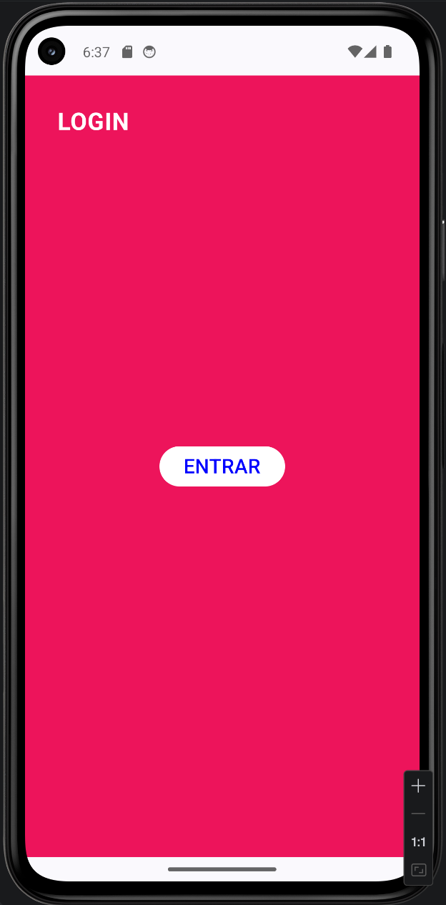
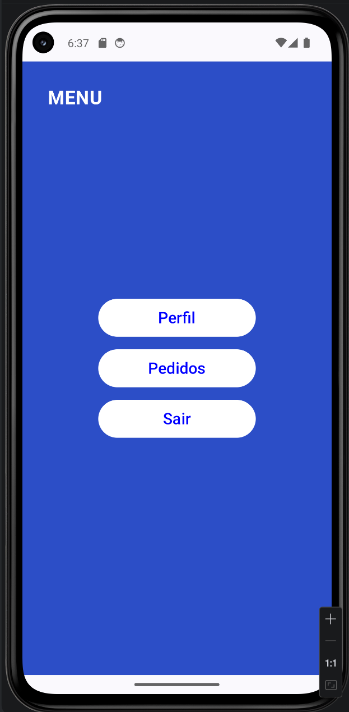
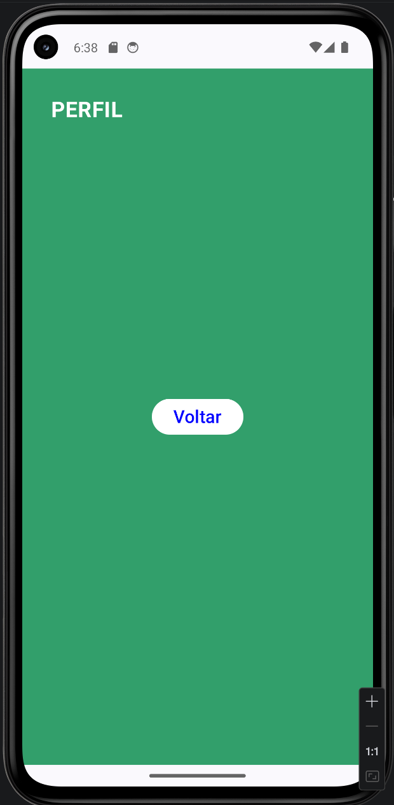
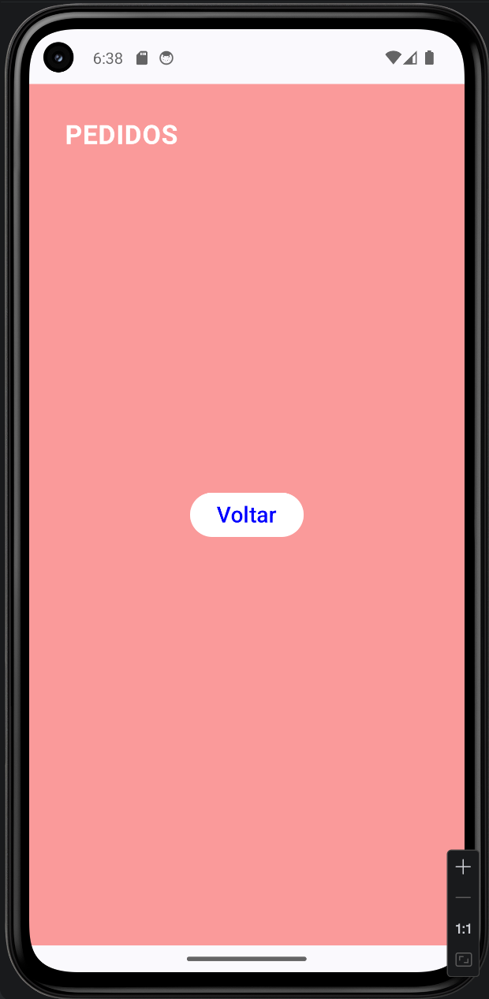

# Navigation
Projeto proposto em aula de Android Kotlin Developer para evolução de prática de navegação entre telas com Jetpack Compose e Navigation Compose. Com o objetivo de aprender Compose, navegação e boas práticas em Kotlin.

O objetivo dessa avaliação é a demonstração por parte do aluno em desenvolver múltiplas telas, Scaffold, innerPadding e NavController.

## Telas do aplicativo

### Login

### Menu

### Perfil

### Pedidos

# Commits
Documentação e explicação dos quatros últimos commits do projeto, até o momento.

Commit — Adiciona chamada da LoginScreen na MainActivity como tela inicial do app
Nesse commit, simplesmente há a conexão da MainActivity com a LoginScreen. O Scaffold, que antes não renderizava nada, passa a chamar esse composable. Na prática, isso define a primeira tela do app, ou seja, a Activity deixa de ser vazia e passa a exibir a UI de login.

Commit — Adiciona dependência androidx.navigation:navigation-compose para suporte à navegação entre telas com Jetpack Compose
É adicionada a biblioteca de navegação do Compose. Esse commit não muda comportamento visível, mas introduz a capacidade de usar NavController, NavHost e rotas. Em termos práticos, é a habilitação da infraestrutura de navegação no projeto.

Commit — Implementa NavController na MainActivity para gerenciar navegação entre telas com Navigation Compose
Ocorre a criação do NavController e substitui a chamada direta da LoginScreen por um NavHost com rotas (login, menu, pedidos, perfil). Isso muda o papel da Activity: ela deixa de renderizar uma tela fixa e passa a atuar como um orquestrador de navegação, decidindo qual tela será exibida com base na rota ativa.

Commit — Implementa navegação entre telas com Navigation Compose, passando NavController e innerPadding para cada tela via MainActivity
Passa o NavController para cada tela e usa ele dentro dos botões (navController.navigate(...)). Isso transforma os botões de elementos estáticos em gatilhos de navegação. Além disso, o innerPadding é propagado para manter o layout correto dentro do Scaffold. É nessa fase que tudo é conectado.

